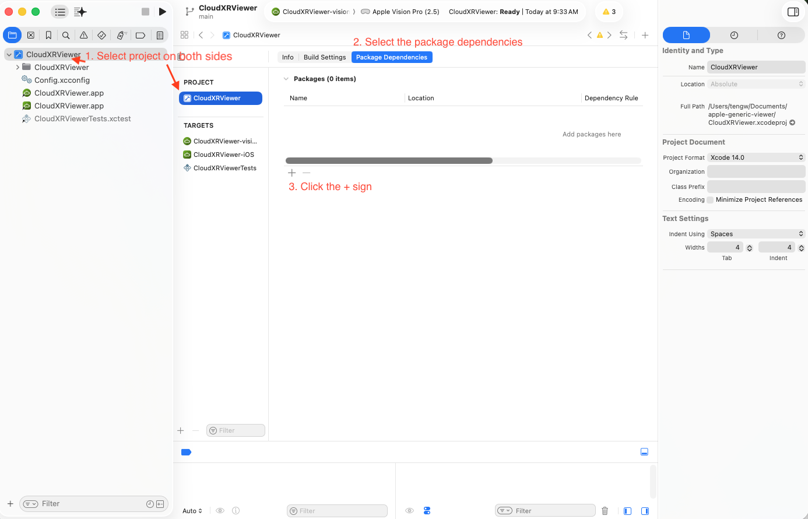
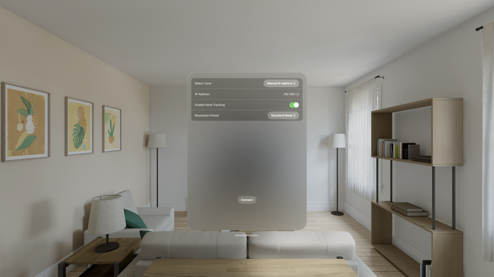
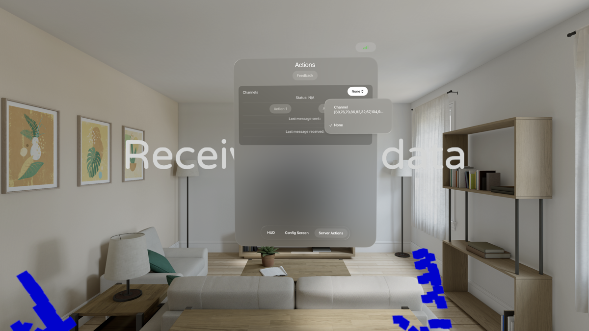
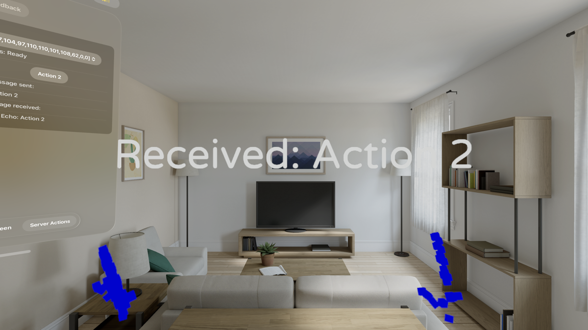

# CloudXR Generic Viewer

A complete reference implementation of a CloudXR client application that demonstrates CloudXRKit SDK integration for Apple Vision Pro (visionOS) and iOS devices. This application enables low-latency streaming of immersive XR content from a remote CloudXR server to Apple devices.

## Features

- **CloudXRKit SDK integration** - Complete reference implementation
- **Full 6DOF tracking support** - Complete head and hand tracking
- **Opaque data channel communication** - Bidirectional messaging with server
- **Hand tracking visualization** - Real-time finger joint tracking display
- **SwiftUI-based user interface** - Modern, declarative UI design
- **Native visionOS and iOS support** - Optimized for both platforms
- **Audio streaming support** - Audio from Windows servers

## About This Project

This Generic Viewer serves as a complete reference implementation for developers building CloudXR client applications on Apple platforms. It demonstrates best practices for CloudXRKit SDK integration and provides a solid foundation that can be customized or extended for specific use cases.

## System Requirements

### Development Requirements

- **macOS** development machine (Apple Silicon or Intel)
- **Xcode 16.4** or later
- **Swift 5.9** or later
- **visionOS 2.4 SDK** (for visionOS development)
- **iOS 18.0 SDK** (for iOS/iPadOS development)

### visionOS Requirements

- **Apple Vision Pro** device
- **visionOS 2.4** or later
- **WiFi connection**: 100 Mbps minimum, 200 Mbps recommended

### iOS/iPadOS Requirements

- **iOS 18.0** or **iPadOS 18.0** or later
- Device with **ARKit support** (see [Apple's AR-compatible devices](https://www.apple.com/augmented-reality/))
- **WiFi connection**: 100 Mbps minimum, 200 Mbps recommended

## Getting Started

### 1. Clone the Repository

```bash
git clone https://github.com/NVIDIA/cloudxr-apple-generic-viewer.git
cd cloudxr-apple-generic-viewer
```

### 2. Open the Project

Open the Xcode project:

```bash
open CloudXRViewer.xcodeproj
```

### 3. Add CloudXR Framework Package

You need to add the CloudXR Framework as a dependency:

#### Option A: Add from Package Repository (Recommended)

1. In Xcode, right-click on the project in Project Navigator
2. Select **"Add Package Dependencies"**
3. Enter the package URL: `https://github.com/NVIDIA/cloudxr-framework`
4. Click **"Add Package"**
5. Select the target(s) you want to build:
   - `CloudXRViewer-visionOS` for Apple Vision Pro
   - `CloudXRViewer-iOS` for iPhone/iPad

#### Option B: Add Local Framework

If you have a local copy of the CloudXR Framework:

1. Download the CloudXR Framework (e.g., `cloudxr-sdk-external-6.0.2-rc2.zip`)
2. Unzip the framework to a local directory
3. In Xcode, select the project in Project Navigator, then navigate to the **Package Dependencies** tab

4. Select **"Add Local..."**
5. Navigate to the unzipped CloudXR Framework directory
6. Select the target(s) to add the package to

### 4. Build and Run

1. Select your target:
   - **CloudXRViewer-visionOS** for Apple Vision Pro
   - **CloudXRViewer-iOS** for iPhone/iPad
2. Select your destination device or simulator
3. Click the **Run** button or press `Cmd+R`

## Usage

### Connecting to a CloudXR Server

1. Launch the CloudXRViewer app on your device
2. In the configuration screen:
   - In the **"Select Zone"** dropdown, choose **"Manual IP address"**
   - Enter your CloudXR server's IP address in the **"IP Address"** field
   - Click **"Connect"**



### In-Headset Experience (visionOS)

**Note:** The server experience described below utilizes the LÖVR reference sample available at https://github.com/NVIDIA/cloudxr-lovr-sample. You can create similar experiences by integrating the CloudXR Runtime into your own OpenXR-based applications.

Once connected, you will see:

- **Streamed XR content**: Immersive content from your CloudXR server
- **Hand tracking visualization**: Blue cubes tracking your finger joints (enable **"Enable Hand Tracking"** toggle in the config screen)
- **Audio streaming**: Audio from the server will play in the headset (Windows servers only)

### Server Actions

To test opaque data channels (for bidirectional messaging with the server):

1. Navigate to the Server Actions view:
   - **visionOS**: Click the **"Server Actions"** tab at the bottom of the window
   - **iOS**: Tap the **"Actions"** button in the overlay controls
2. In the **"Channels"** dropdown, select an available channel



3. Use the **"Action 1"** and **"Action 2"** buttons to send test messages to the server
4. Observe server responses in the **"Last message received"** field



## Project Structure

```
CloudXRViewer/
├── Common/                  # Shared code between iOS and visionOS
│   ├── AppDelegate.swift    # Application delegate
│   ├── AppModel.swift       # Main app state model
│   ├── ViewerApp.swift      # App entry point
│   ├── SessionConfigView.swift    # Connection configuration UI
│   ├── ServerActionsView.swift    # Data channel testing UI
│   └── ...
├── iOS/                     # iOS-specific implementations
│   ├── LaunchView+iOS.swift
│   ├── StreamingView+iOS.swift
│   └── ...
├── visionOS/                # visionOS-specific implementations
│   ├── ImmersiveView.swift
│   ├── LaunchView+visionOS.swift
│   ├── WindowUI.swift       # Main window with HUD, Config, Actions tabs
│   └── ...
└── Assets.xcassets/         # App icons and assets
```

## Configuration

The app supports configuration through `Config.xcconfig` for build-time settings and `Settings.bundle` for runtime settings accessible through the iOS Settings app.

## Known Issues

### Code Signing and Apple Developer Program

If the client fails to build with code signing errors, your Apple ID likely isn't enrolled in the [Apple Developer Program (ADP)](https://developer.apple.com/programs/). Apple Low‑Latency Streaming features are available only to ADP members. Some accounts may be eligible to enroll at no cost.

**To disable Low-Latency Streaming and build without ADP:**

1. In Xcode, select your project in the Project Navigator
2. Go to **Build Settings**
3. Search for **Code Signing Entitlements**
4. Delete or clear the entitlements file reference
5. Rebuild the project

Note that disabling these entitlements may impact streaming performance and latency.

### Network Reachability

Many institutional or enterprise WiFi networks prevent devices from reaching each other directly due to client isolation policies. If your Apple Vision Pro cannot discover or connect to the CloudXR server:

- Use a dedicated WiFi router where both devices are connected
- Ensure both devices are on the same subnet
- Check that your network allows peer-to-peer communication
- Consider setting up a local network specifically for XR streaming

## Troubleshooting

### Connection Issues

- Ensure your device and server are on the same network
- Verify firewall rules on the server allow CloudXR connections
- Check that the server IP address is entered correctly
- Ensure the CloudXR server is running before attempting to connect

### Build Issues

- Verify you're using Xcode 16.4 or later
- Ensure the CloudXR Framework package is properly added to your target
- Clean the build folder (Product > Clean Build Folder) and rebuild

### Performance Issues

- Check your WiFi connection speed (minimum 100 Mbps, recommended 200 Mbps)
- Ensure you're on a stable network with low latency to the server
- Reduce network congestion by using a dedicated WiFi network if possible

## License

See [LICENSE](LICENSE) file for details.

## Additional Resources

- [CloudXR Framework](https://github.com/NVIDIA/cloudxr-framework)
- [CloudXR Documentation](https://docs.nvidia.com/cloudxr-sdk)

## Contributing

This project is not currently accepting external contributions.